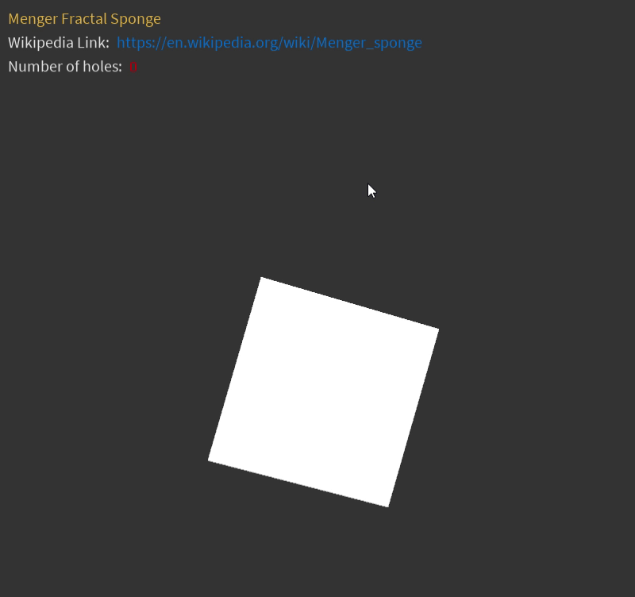

# Menger_fractal_sponge
This is a simulation of a Menger Sponge. The Menger Sponge is a 3D fractal curve created by submeshing every face of a cube into another cube.

<h2> How to use </h2>

  To submesh the cubes on the simulation, just press the left button of your mouse. BE CAREFUL OF HOW MANY SUBMESHES YOU ADD; IT CAN GET VERY HEAVY!

 

